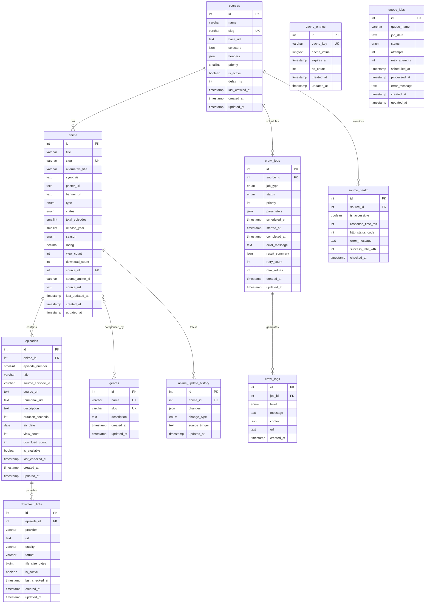

# NIME Crawler

<p align="center">
  <a href="http://nestjs.com/" target="blank"></a>
</p>

## Description

NIME Crawler is a sophisticated anime aggregation and crawling service built with [Nest](https://github.com/nestjs/nest) framework. It provides a robust microservice architecture for crawling, processing, and serving anime content from various sources.

## Architecture Overview

### Microservice Architecture


### Service Descriptions

1. **API Gateway**
   - NestJS + Express based gateway
   - Routes requests to appropriate microservices
   - Handles authentication and rate limiting
   - API documentation and client SDK generation

2. **Core Services**
   - **Crawler Service**: Content extraction with rate limiting and retry mechanisms
   - **Scheduler Service**: Job scheduling and dispatching with priority management
   - **API Service**: GraphQL/REST endpoints with response caching
   - **Link Checker**: Download link validation and health monitoring
   - **Analytics Service**: Usage statistics and performance metrics
   - **Notification Service**: Multi-channel notifications (Discord, Telegram, Email)

3. **Infrastructure Components**
   - **Message Queue**: RabbitMQ for service communication
   - **Database**: MySQL with read replicas
   - **Cache**: Redis for data caching and session management
   - **Service Discovery**: Consul for service registry
   - **Monitoring**: 
     - Prometheus for metrics collection
     - Loki for log aggregation
     - Grafana for visualization
   - **Load Balancer**: Nginx for traffic distribution

4. **External Integrations**
   - Discord Webhooks for notifications
   - Telegram Bot API for updates
   - Email Service (SendGrid/SES) for alerts
   - Object Storage for media files

### Database Schema (TypeORM Entities)



## Technical Stack

- **Framework**: NestJS with TypeScript
- **Database**: MySQL with TypeORM
- **Caching**: Redis
- **Message Queue**: RabbitMQ
- **Service Discovery**: Consul
- **Monitoring**: 
  - Prometheus for metrics collection
  - Loki for log aggregation
  - Grafana for visualization

## Development Setup

### Prerequisites
- Node.js 16+
- Docker & Docker Compose
- TypeScript 4.5+

### Installation
```bash
$ yarn install
```

### Running the Application
```bash
# development
$ yarn run start

# watch mode
$ yarn run start:dev

# production mode
$ yarn run start:prod
```

### Testing
```bash
# unit tests
$ yarn run test

# e2e tests
$ yarn run test:e2e

# test coverage
$ yarn run test:cov
```

## Production Deployment

### Environment Variables
```env
# App
PORT=3000
NODE_ENV=production

# Database (VPC Internal)
DATABASE_HOST=your-db-internal-vpc-endpoint
DATABASE_PORT=3306
DATABASE_USER=your-db-user
DATABASE_PASSWORD=your-db-password
DATABASE_NAME=nime_crawler

# Connection Pool
DATABASE_POOL_MIN=5
DATABASE_POOL_MAX=20
DATABASE_TIMEOUT=60000

# Redis
REDIS_HOST=redis
REDIS_PORT=6379

# RabbitMQ
RABBITMQ_URL=amqp://rabbitmq:5672

# Service Discovery
CONSUL_HOST=localhost
CONSUL_PORT=8500

# Discord Bot Configuration (necord)
DISCORD_TOKEN=your-bot-token
DISCORD_CLIENT_ID=your-client-id
DISCORD_GUILD_ID=your-guild-id
DISCORD_NOTIFICATION_CHANNEL_ID=your-channel-id

# Telegram Bot Configuration (nestjs-telegraf)
TELEGRAM_BOT_TOKEN=your-bot-token
TELEGRAM_WEBHOOK_URL=https://your-domain.com/telegram/webhook
TELEGRAM_WEBHOOK_PATH=/telegram/webhook
TELEGRAM_ADMIN_IDS=123456789,987654321
TELEGRAM_NOTIFICATION_CHAT_ID=-1001234567890

# MailerSend Configuration
MAILERSEND_API_KEY=your-mailersend-api-key
MAILERSEND_FROM_EMAIL=noreply@your-domain.com

# Grafana
GRAFANA_ADMIN_PASSWORD=your-secure-password
```

### Docker Compose Configuration

```yaml
version: '3.8'

x-logging: &default-logging
  driver: loki
  options:
    loki-url: "http://loki:3100/loki/api/v1/push"
    loki-pipeline-stages: |
      - json:
          expressions:
            level: level
            timestamp: timestamp
            message: message
            service: service
      - labels:
          level:
          service:
    loki-external-labels: "job=nime-crawler,environment=production"

services:
  # API Gateway
  api-gateway:
    build:
      context: .
      dockerfile: ./services/api-gateway/Dockerfile
    image: nime-crawler/api-gateway
    restart: unless-stopped
    ports:
      - "3000:3000"
    environment:
      - NODE_ENV=production
      - DATABASE_HOST=${DATABASE_HOST}
      - DATABASE_PORT=${DATABASE_PORT}
      - DATABASE_USER=${DATABASE_USER}
      - DATABASE_PASSWORD=${DATABASE_PASSWORD}
      - DATABASE_NAME=${DATABASE_NAME}
      - DATABASE_POOL_MIN=${DATABASE_POOL_MIN}
      - DATABASE_POOL_MAX=${DATABASE_POOL_MAX}
      - REDIS_HOST=redis
      - RABBITMQ_URL=amqp://rabbitmq:5672
    logging: *default-logging
    networks:
      - app-network

  # Crawler Service
  crawler-service:
    build:
      context: .
      dockerfile: ./services/crawler/Dockerfile
    image: nime-crawler/crawler
    restart: unless-stopped
    environment:
      - NODE_ENV=production
      - DATABASE_HOST=${DATABASE_HOST}
      - DATABASE_PORT=${DATABASE_PORT}
      - DATABASE_USER=${DATABASE_USER}
      - DATABASE_PASSWORD=${DATABASE_PASSWORD}
      - DATABASE_NAME=${DATABASE_NAME}
      - DATABASE_POOL_MIN=${DATABASE_POOL_MIN}
      - DATABASE_POOL_MAX=${DATABASE_POOL_MAX}
      - REDIS_HOST=redis
      - RABBITMQ_URL=amqp://rabbitmq:5672
    logging: *default-logging
    networks:
      - app-network

  # Scheduler Service
  scheduler-service:
    build:
      context: .
      dockerfile: ./services/scheduler/Dockerfile
    image: nime-crawler/scheduler
    restart: unless-stopped
    environment:
      - NODE_ENV=production
      - DATABASE_HOST=${DATABASE_HOST}
      - DATABASE_PORT=${DATABASE_PORT}
      - DATABASE_USER=${DATABASE_USER}
      - DATABASE_PASSWORD=${DATABASE_PASSWORD}
      - DATABASE_NAME=${DATABASE_NAME}
      - DATABASE_POOL_MIN=${DATABASE_POOL_MIN}
      - DATABASE_POOL_MAX=${DATABASE_POOL_MAX}
      - REDIS_HOST=redis
      - RABBITMQ_URL=amqp://rabbitmq:5672
    logging: *default-logging
    networks:
      - app-network

  # Link Checker Service
  link-checker-service:
    build:
      context: .
      dockerfile: ./services/link-checker/Dockerfile
    image: nime-crawler/link-checker
    restart: unless-stopped
    environment:
      - NODE_ENV=production
      - DATABASE_HOST=${DATABASE_HOST}
      - DATABASE_PORT=${DATABASE_PORT}
      - DATABASE_USER=${DATABASE_USER}
      - DATABASE_PASSWORD=${DATABASE_PASSWORD}
      - DATABASE_NAME=${DATABASE_NAME}
      - DATABASE_POOL_MIN=${DATABASE_POOL_MIN}
      - DATABASE_POOL_MAX=${DATABASE_POOL_MAX}
      - REDIS_HOST=redis
      - RABBITMQ_URL=amqp://rabbitmq:5672
    logging: *default-logging
    networks:
      - app-network

  # Analytics Service
  analytics-service:
    build:
      context: .
      dockerfile: ./services/analytics/Dockerfile
    image: nime-crawler/analytics
    restart: unless-stopped
    environment:
      - NODE_ENV=production
      - DATABASE_HOST=${DATABASE_HOST}
      - DATABASE_PORT=${DATABASE_PORT}
      - DATABASE_USER=${DATABASE_USER}
      - DATABASE_PASSWORD=${DATABASE_PASSWORD}
      - DATABASE_NAME=${DATABASE_NAME}
      - DATABASE_POOL_MIN=${DATABASE_POOL_MIN}
      - DATABASE_POOL_MAX=${DATABASE_POOL_MAX}
      - REDIS_HOST=redis
      - RABBITMQ_URL=amqp://rabbitmq:5672
    logging: *default-logging
    networks:
      - app-network

  # Notification Service
  notification-service:
    build:
      context: .
      dockerfile: ./services/notification/Dockerfile
    image: nime-crawler/notification
    restart: unless-stopped
    environment:
      # Database
      - NODE_ENV=production
      - DATABASE_HOST=${DATABASE_HOST}
      - DATABASE_PORT=${DATABASE_PORT}
      - DATABASE_USER=${DATABASE_USER}
      - DATABASE_PASSWORD=${DATABASE_PASSWORD}
      - DATABASE_NAME=${DATABASE_NAME}
      - DATABASE_POOL_MIN=${DATABASE_POOL_MIN}
      - DATABASE_POOL_MAX=${DATABASE_POOL_MAX}
      
      # Message Queue
      - REDIS_HOST=redis
      - RABBITMQ_URL=amqp://rabbitmq:5672
      
      # Discord Bot (necord)
      - DISCORD_TOKEN=${DISCORD_TOKEN}
      - DISCORD_CLIENT_ID=${DISCORD_CLIENT_ID}
      - DISCORD_GUILD_ID=${DISCORD_GUILD_ID}
      - DISCORD_NOTIFICATION_CHANNEL_ID=${DISCORD_NOTIFICATION_CHANNEL_ID}
      
      # Telegram Bot (nestjs-telegraf)
      - TELEGRAM_BOT_TOKEN=${TELEGRAM_BOT_TOKEN}
      - TELEGRAM_WEBHOOK_URL=${TELEGRAM_WEBHOOK_URL}
      - TELEGRAM_WEBHOOK_PATH=${TELEGRAM_WEBHOOK_PATH}
      - TELEGRAM_ADMIN_IDS=${TELEGRAM_ADMIN_IDS}
      - TELEGRAM_NOTIFICATION_CHAT_ID=${TELEGRAM_NOTIFICATION_CHAT_ID}
    logging: *default-logging
    networks:
      - app-network

  # Mailer Service
  mailer-service:
    build:
      context: .
      dockerfile: ./services/mailer/Dockerfile
    image: nime-crawler/mailer
    restart: unless-stopped
    ports:
      - "3002:3000"  # For React Email preview
    environment:
      # Service Config
      - NODE_ENV=production
      - PORT=3000
      
      # Database
      - DATABASE_HOST=${DATABASE_HOST}
      - DATABASE_PORT=${DATABASE_PORT}
      - DATABASE_USER=${DATABASE_USER}
      - DATABASE_PASSWORD=${DATABASE_PASSWORD}
      - DATABASE_NAME=${DATABASE_NAME}
      - DATABASE_POOL_MIN=${DATABASE_POOL_MIN}
      - DATABASE_POOL_MAX=${DATABASE_POOL_MAX}
      
      # Message Queue
      - REDIS_HOST=redis
      - RABBITMQ_URL=amqp://rabbitmq:5672
      
      # MailerSend Configuration
      - MAILERSEND_API_KEY=${MAILERSEND_API_KEY}
      - MAILERSEND_FROM_EMAIL=${MAILERSEND_FROM_EMAIL}
      - MAILERSEND_FROM_NAME="NIME Crawler"
      
      # React Email Preview (development only)
      - EMAIL_PREVIEW_PORT=3000
    volumes:
      - ./services/mailer/emails:/app/emails
    logging: *default-logging
    networks:
      - app-network

  # Infrastructure Services
  redis:
    image: redis:6-alpine
    restart: unless-stopped
    volumes:
      - ~/service/redis_data:/data
      - ./docker/redis/redis.conf:/etc/nginx/redis.conf:ro
    logging: *default-logging
    networks:
      - app-network

  rabbitmq:
    image: rabbitmq:3-management-alpine
    restart: unless-stopped
    ports:
      - "15672:15672"  # Management UI
    volumes:
      - rabbitmq-data:/var/lib/rabbitmq
    logging: *default-logging
    networks:
      - app-network

  # Service Discovery
  consul:
    image: consul:1.9
    restart: unless-stopped
    ports:
      - "8500:8500"
    volumes:
      - consul-data:/consul/data
    logging: *default-logging
    networks:
      - app-network

  # Monitoring Stack
  prometheus:
    image: prom/prometheus:latest
    restart: unless-stopped
    volumes:
      - ./docker/prometheus/prometheus.yml:/etc/prometheus/prometheus.yml:ro
      - prometheus-data:/prometheus
    command:
      - '--config.file=/etc/prometheus/prometheus.yml'
      - '--storage.tsdb.path=/prometheus'
      - '--web.console.libraries=/usr/share/prometheus/console_libraries'
      - '--web.console.templates=/usr/share/prometheus/consoles'
    logging: *default-logging
    networks:
      - app-network

  loki:
    image: grafana/loki:latest
    restart: unless-stopped
    ports:
      - "3100:3100"
    command: -config.file=/etc/loki/local-config.yaml
    volumes:
      - ./docker/loki/local-config.yaml:/etc/loki/local-config.yaml:ro
      - loki-data:/loki
    networks:
      - app-network

  grafana:
    image: grafana/grafana:latest
    restart: unless-stopped
    ports:
      - "3001:3000"
    environment:
      - GF_SECURITY_ADMIN_PASSWORD=${GRAFANA_ADMIN_PASSWORD}
      - GF_USERS_ALLOW_SIGN_UP=false
      - GF_INSTALL_PLUGINS=grafana-piechart-panel
    volumes:
      - ./docker/grafana/provisioning:/etc/grafana/provisioning
      - grafana-data:/var/lib/grafana
    logging: *default-logging
    depends_on:
      - prometheus
      - loki
    networks:
      - app-network

  # Load Balancer
  nginx:
    image: nginx:alpine
    restart: unless-stopped
    ports:
      - "80:80"
      - "443:443"
    volumes:
      - ./docker/nginx/nginx.conf:/etc/nginx/nginx.conf:ro
      - ./docker/nginx/certs:/etc/nginx/certs:ro
    logging: *default-logging
    depends_on:
      - api-gateway
    networks:
      - app-network

networks:
  app-network:
    driver: bridge

volumes:
  rabbitmq-data:
  consul-data:
  prometheus-data:
  loki-data:
  grafana-data:
```

### Loki Configuration

Create `docker/loki/local-config.yaml`:

```yaml
auth_enabled: false

server:
  http_listen_port: 3100

ingester:
  lifecycler:
    address: 127.0.0.1
    ring:
      kvstore:
        store: inmemory
      replication_factor: 1
    final_sleep: 0s
  chunk_idle_period: 5m
  chunk_retain_period: 30s

schema_config:
  configs:
    - from: 2020-10-24
      store: boltdb-shipper
      object_store: filesystem
      schema: v11
      index:
        prefix: index_
        period: 24h

storage_config:
  boltdb_shipper:
    active_index_directory: /loki/index
    cache_location: /loki/cache
    cache_ttl: 24h
    shared_store: filesystem
  filesystem:
    directory: /loki/chunks

limits_config:
  enforce_metric_name: false
  reject_old_samples: true
  reject_old_samples_max_age: 168h

chunk_store_config:
  max_look_back_period: 0s

table_manager:
  retention_deletes_enabled: true
  retention_period: 672h
```

### Grafana Provisioning

Create `docker/grafana/provisioning/datasources/datasources.yaml`:

```yaml
apiVersion: 1

datasources:
  - name: Prometheus
    type: prometheus
    access: proxy
    url: http://prometheus:9090
    isDefault: true

  - name: Loki
    type: loki
    access: proxy
    url: http://loki:3100
    jsonData:
      maxLines: 1000
```

### Redis Data Management

```bash
# Create Redis data directory
mkdir -p ~/service/redis_data
chmod 777 ~/service/redis_data

# Backup Redis data
tar -czf redis_backup_$(date +%Y%m%d).tar.gz ~/service/redis_data/

# Restore Redis data
docker compose stop redis
tar -xzf redis_backup_20240101.tar.gz -C /
docker compose start redis
```

## Project Structure

```
.
├── package.json
├── yarn.lock
├── tsconfig.json
├── .env.example
├── docker-compose.yml
├── docker-compose.prod.yml
├── README.md
│
├── libs/                           # Shared libraries
│   ├── common/                     # Common utilities and types
│   │   ├── constants/
│   │   ├── decorators/
│   │   ├── dto/
│   │   ├── entities/              # TypeORM entities
│   │   ├── enums/
│   │   ├── interfaces/
│   │   └── utils/
│   │
│   ├── database/                   # Database related modules
│   │   ├── migrations/
│   │   ├── seeds/
│   │   └── config/
│   │
│   └── queue/                      # Queue related modules
│       ├── producers/
│       └── consumers/
│
├── services/                       # Microservices
│   ├── api-gateway/               # API Gateway Service
│   │   ├── src/
│   │   │   ├── auth/
│   │   │   ├── controllers/
│   │   │   ├── guards/
│   │   │   └── main.ts
│   │   ├── Dockerfile
│   │   └── package.json
│   │
│   ├── crawler/                   # Crawler Service
│   │   ├── src/
│   │   │   ├── scrapers/
│   │   │   ├── processors/
│   │   │   ├── validators/
│   │   │   └── main.ts
│   │   ├── Dockerfile
│   │   └── package.json
│   │
│   ├── scheduler/                 # Scheduler Service
│   │   ├── src/
│   │   │   ├── jobs/
│   │   │   ├── triggers/
│   │   │   └── main.ts
│   │   ├── Dockerfile
│   │   └── package.json
│   │
│   ├── link-checker/             # Link Checker Service
│   │   ├── src/
│   │   │   ├── checkers/
│   │   │   ├── providers/
│   │   │   └── main.ts
│   │   ├── Dockerfile
│   │   └── package.json
│   │
│   ├── analytics/                # Analytics Service
│   │   ├── src/
│   │   │   ├── collectors/
│   │   │   ├── processors/
│   │   │   └── main.ts
│   │   ├── Dockerfile
│   │   └── package.json
│   │
│   ├── notification/             # Notification Service
│   │   ├── src/
│   │   │   ├── discord/         # Discord.js (necord)
│   │   │   ├── telegram/        # nestjs-telegraf
│   │   │   └── main.ts
│   │   ├── Dockerfile
│   │   └── package.json
│   │
│   └── mailer/                   # Mailer Service
│       ├── src/
│       │   ├── api/             # Email API endpoints
│       │   ├── templates/       # React Email templates
│       │   └── main.ts
│       ├── emails/              # React Email components
│       │   ├── components/
│       │   └── templates/
│       ├── Dockerfile
│       └── package.json
│
├── docker/                        # Docker configurations
│   ├── nginx/
│   │   ├── nginx.conf
│   │   └── certs/
│   │
│   ├── prometheus/
│   │   └── prometheus.yml
│   │
│   ├── grafana/
│   │   ├── provisioning/
│   │   │   ├── dashboards/
│   │   │   └── datasources/
│   │   └── dashboards/
│   │
│   └── loki/
│       └── local-config.yaml
│
├── scripts/                       # Utility scripts
│   ├── setup.sh
│   ├── deploy.sh
│   └── backup.sh
│
└── docs/                         # Documentation
    ├── api/                      # API documentation
    ├── architecture/             # Architecture diagrams
    └── development/              # Development guides
```

### Key Directories

- `libs/`: Shared code between services
  - `common/`: Shared utilities, types, and constants
  - `database/`: Database migrations and configurations
  - `queue/`: Message queue producers and consumers

- `services/`: Individual microservices
  - Each service has its own:
    - Source code (`src/`)
    - Dockerfile
    - Package.json
    - Service-specific configurations

- `docker/`: Infrastructure configurations
  - Service configurations
  - SSL certificates
  - Monitoring setup

- `scripts/`: Utility scripts for development and deployment

- `docs/`: Project documentation
  - API specifications
  - Architecture diagrams
  - Development guides

## Contributing

Please ensure your code:
- Follows NestJS best practices
- Includes unit and e2e tests
- Is properly documented
- Handles errors appropriately
- Includes proper Sentry error tracking

## License

This project is [MIT licensed](LICENSE).

## Resources

Check out a few resources that may come in handy when working with NestJS:

- Visit the [NestJS Documentation](https://docs.nestjs.com) to learn more about the framework.
- For questions and support, please visit our [Discord channel](https://discord.gg/G7Qnnhy).
- To dive deeper and get more hands-on experience, check out our official video [courses](https://courses.nestjs.com/).
- Deploy your application to AWS with the help of [NestJS Mau](https://mau.nestjs.com) in just a few clicks.
- Visualize your application graph and interact with the NestJS application in real-time using [NestJS Devtools](https://devtools.nestjs.com).
- Need help with your project (part-time to full-time)? Check out our official [enterprise support](https://enterprise.nestjs.com).
- To stay in the loop and get updates, follow us on [X](https://x.com/nestframework) and [LinkedIn](https://linkedin.com/company/nestjs).
- Looking for a job, or have a job to offer? Check out our official [Jobs board](https://jobs.nestjs.com).

## Support

Nest is an MIT-licensed open source project. It can grow thanks to the sponsors and support by the amazing backers. If you'd like to join them, please [read more here](https://docs.nestjs.com/support).

## Stay in touch

- Author - [Kamil Myśliwiec](https://twitter.com/kammysliwiec)
- Website - [https://nestjs.com](https://nestjs.com/)
- Twitter - [@nestframework](https://twitter.com/nestframework)
